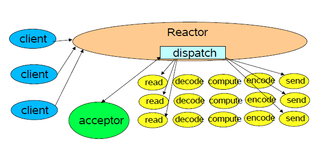

# Reactor 模式

> 处理 web 的数据，往往有两种处理的方式，一种是基于线程；另一种是基于事件驱动

## 高性能 IO 之 Reactor 模式

讲到高性能IO绕不开Reactor模式，它是大多数IO相关组件如Netty、Redis在使用的IO模式，为什么需要这种模式，它是如何设计来解决高性能并发的呢？

1. **最原始的网络编程的思路**

服务器使用一个 ```while``` 循环，在循环当中不断的检测是否有新的套接字连接。如果有的话，就调用一个处理函数进行处理。

* 没有办法进行并发，效率太低，后面的请求只能进行阻塞

2. **多线程的方式**

典型的模式就是使用 ```while``` 对端口进行处理，有新的连接的到达就立刻使用一个新的线程对这个连接进行处理，当前的 ```while``` 循环只处理连接

* 线程同步的粒度太大了，限制了吞吐量。应该把一次连接的操作再细分为粒度更小的过程。这些更细的粒度是更小的线程。整个线程池的大小会增大，但是每一个线程的工作更加的单一 

3. **Reactor 模式**



reactor 模式主要由下面的几个组件构成：

* handle : 在 linux 当中被称作文件描述符，它是所有事件的发源地，通过监控相应的 handle 我们可以监控相应的事件

* Synchronous Event Demultiplexer：同步事件分离。比如 linux 上的 select poll epoll 等等

* 