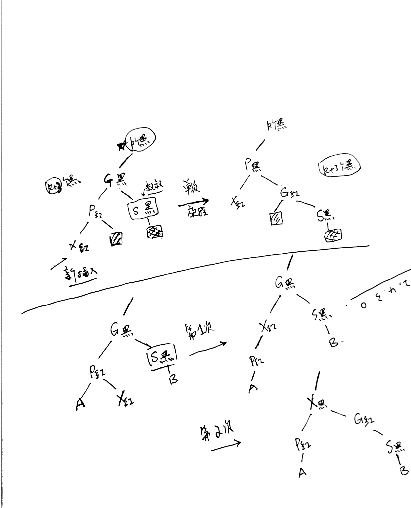
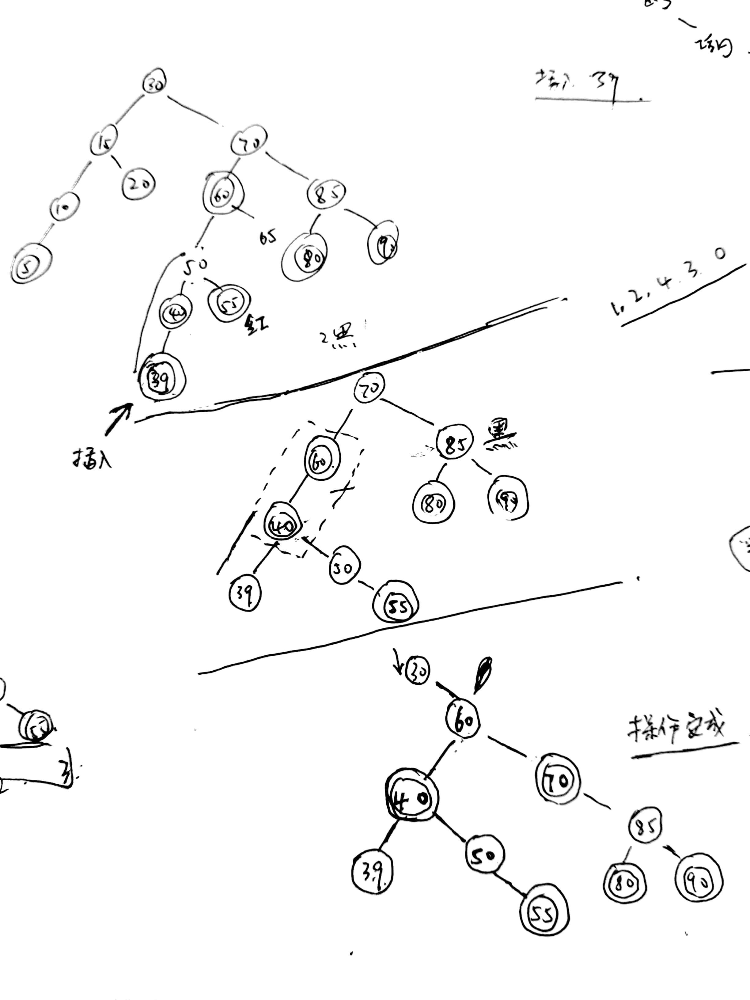

## 红黑树的基本性质

1. 所有的节点要么是黑色的，要么是红色的
2. 根节点是黑色的
3. 红色节点的两个儿子节点一定是黑色的
4. 从根节点到任意一个叶子节点的路径中黑色节点的个数都是相同的
5. 每一个叶子节点 (NULL节点) 都是黑色的

## 插入的过程

> 插入的节点都设置为红色的

1. 如果插入节点的父亲节点是一个黑色的节点，那么插入直接完成，不需要进行任何的改变

2. 如果插入的节点的父亲的节点是一个红色的节点，那么就会发生冲突

2.1 如果插入节点（红色）的父亲节点（红色） 的兄弟节点是一个黑色的节点；我们需要进行一次旋转的操作

2.2 如果插入节点（红色）的父亲节点（红色） 的兄弟节点是一个红的的节点，我们依然按照上面的旋转的过程进行操作。但是颜色的找色的方式发生了一点点的变化，并且，可能父需要从底部往上面进行多次旋转的操作

##删除的过程

> 红黑数删除的策略和平衡二叉树的策略是一样的，并不是直接删除这个节点。而是使用这个节点的右子树的最大值填充到待删除的节点当中，然后去删除右子树中的对应的节点（如果没有右子树，那么直接将左子树赋值给自己的父亲节点的儿子就可以了）。

但是需要注意的是，删除的过程可能会破坏红黑数的性质，所以需要对树进行调整

删除有下面的几种情况：

1. 要删除的是一个红色的叶子节点，那么直接删除就可以了，不需要任何多余的操作

2. 要删除的是一个黑色的叶子节点，那么在删除之后，需要进行调整

3. 删除的节点有两个儿子节点，那么从右边的儿子节点中找到最小的节点，将这个节点的值赋值给待删除的节点，之后转而去删除右子树中的那一个儿子节点（这个儿子节点要么没有任何的子结点，要么只有一个右儿子）

4. 要删除的节点只有一个左儿子

5. 要删除的节点只有一个右儿子

